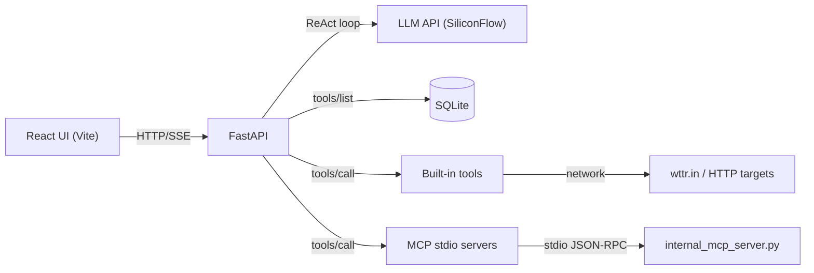

# MCP ReAct Demo (FastAPI + React)

这是一个端到端的 ReAct 风格 Agent 示例项目，包含：
1. 以 MCP 规范列出工具
2. 让 LLM 选择并调用工具
3. 执行工具（内置或外部 MCP server）
4. 通过 SSE 将步骤实时流式输出到前端

项目包含后端（FastAPI）和前端（Vite + React）。

> English version: `README.en.md`

## 功能特性

- ReAct Agent + SSE 流式输出（`/api/agent/chat-stream`）
- 内置工具：
  - `get_weather`（调用 `wttr.in`）
  - `http_get_text`
  - `browser_screenshot`（Playwright，输出到 `/static/screenshots/*.png`）
- 外部 MCP server（stdio）集成
- 工具与 MCP server 配置存储于 SQLite

## 架构



## 项目结构

- `app/`
  - `main.py` FastAPI 应用
  - `routers/`
    - `agent.py` ReAct + SSE 流式
    - `tools.py` 工具管理 API
    - `mcp_servers.py` MCP server 管理 API
  - `mcp_client.py` MCP stdio 客户端（SDK）
  - `mcp_tools.py` 工具调度（内置 + MCP）
  - `internal_mcp_server.py` 内部 MCP server（stdio）
  - `internal_tools_impl.py` 工具实现
  - `db.py` SQLite 初始化
  - `models.py`, `schemas.py`
- `frontend/` Vite + React UI
- `static/` 静态文件（截图）
- `mcp_demo.sqlite3` SQLite 数据库（首次启动自动创建）

## 环境要求

- Python 3.11+
- Node.js 18+
- macOS/Linux（Playwright 需要）

## 后端安装

```bash
cd /Users/pxy/PycharmProjects/mcp_train
python -m venv .venv
source .venv/bin/activate
pip install -r requirements.txt
python -m playwright install
```

### 环境变量

后端调用 SiliconFlow OpenAI 兼容接口：

```bash
export SILICONFLOW_API_KEY="your_key_here"
```

如果未设置，`app/llm_client.py` 内部会回退到写死的 key（不建议生产使用）。

## 前端安装

```bash
cd /Users/pxy/PycharmProjects/mcp_train/frontend
npm install
```

## 运行（开发模式）

### 启动后端

```bash
cd /Users/pxy/PycharmProjects/mcp_train
uvicorn app.main:create_app --reload --host 0.0.0.0 --port 8000
```

### 启动前端

```bash
cd /Users/pxy/PycharmProjects/mcp_train/frontend
npm run dev
```

浏览器访问：
- `http://localhost:5173`

后端 API：
- `http://localhost:8000`

## API 列表

- `GET /api/tools` 获取工具列表
- `POST /api/tools` 新增工具（schema 保存到 DB）
- `DELETE /api/tools/{id}` 删除工具
- `GET /api/mcp-servers` 获取 MCP server 列表
- `POST /api/mcp-servers` 新增 MCP server
- `POST /api/mcp-servers/{id}/refresh-tools` 刷新 MCP tools
- `DELETE /api/mcp-servers/{id}` 删除 MCP server
- `POST /api/agent/chat` 同步 ReAct
- `POST /api/agent/chat-stream` SSE 流式 ReAct

### SSE 测试示例

```bash
curl -N 'http://127.0.0.1:8000/api/agent/chat-stream' \
  -H 'Content-Type: application/json' \
  --data-raw '{
    "message":"帮我查一下北京2026-03-15的天气，然后用自然语言总结。",
    "max_steps":4,
    "model_id":"Pro/MiniMaxAI/MiniMax-M2.5"
  }'
```

SSE 事件：
- `meta`：会话信息
- `step`：`thought` / `action` / `observation` / `final`
- `done`：最终输出

## 内置工具说明

- `get_weather`
  - 实际调用 `https://wttr.in/<city>?format=3`
  - `date` 参数会被记录在输出中，但实际查询是当前天气
- `http_get_text`
  - GET 抓取 URL 文本并截断返回
- `browser_screenshot`
  - Playwright headless 截图
  - 保存到 `static/screenshots/`
  - 返回 `/static/screenshots/<file>.png`

## MCP Server 配置

MCP server 通过 `/api/mcp-servers` 配置并保存到 `mcp_demo.sqlite3`。
内部 MCP server（`app/internal_mcp_server.py`）默认提供：

- `get_weather`
- `http_get_text`
- `browser_screenshot`

外部 MCP server 需要配置：

- `command`
- `args`（JSON 数组）
- `cwd`（可选）
- `enabled`

后端通过官方 `mcp` SDK 走 stdio 调用 `tools/list` 和 `tools/call`。

## 常见问题

- `browser_screenshot` 失败：
  ```bash
  python -m playwright install
  ```
- internal MCP server 启动失败：
  确认运行时使用的是虚拟环境 Python
- LLM 调用失败：
  检查 `SILICONFLOW_API_KEY`
- SQLite 文件：
  `mcp_demo.sqlite3`

## 说明

这是一个可运行的最小示例，便于验证 ReAct + MCP + SSE 的完整链路。
