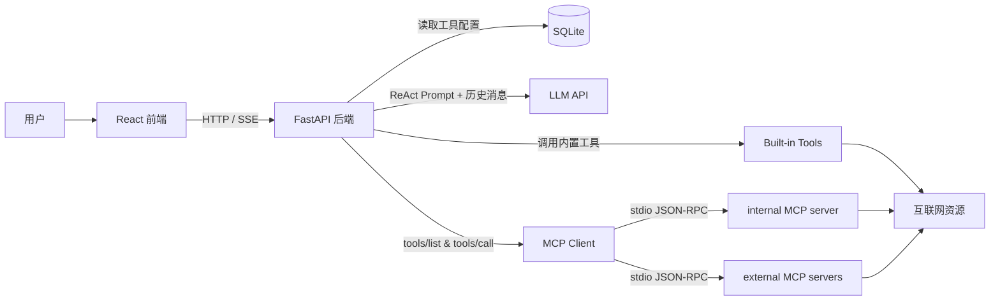
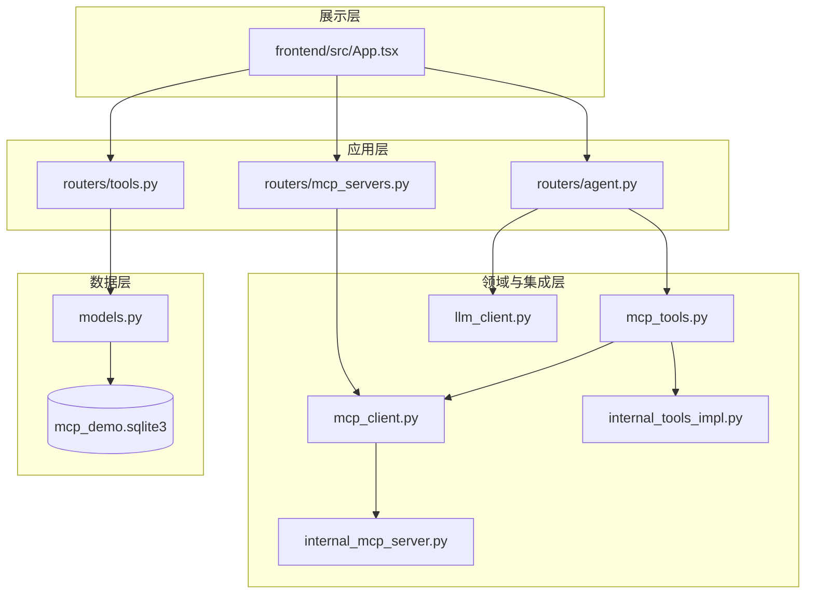

# MCP ReAct Demo 项目能力说明

## 1. 项目整体架构

这是一个“可运行的 Agent 工程样例”，目标是把以下链路串起来：

- 前端发起问题
- 后端进行 ReAct 推理与工具调度
- 工具既可以是本地内置实现，也可以是外部 MCP Server
- 推理过程通过 SSE 实时回传到前端

### 1.1 分层视角

---

## 2. 各部分概念与横向扩展

## 2.1 Agent 推理模式：ReAct 与 Plan-and-Execute

项目中的 Agent 主路径在 `app/routers/agent.py`，核心做法是：

- LLM 输出标准 JSON 步骤（thought / action / observation / final）
- 后端执行 action 后把 observation 回灌给模型
- 直到得到 final 或达到 max_steps

这里同时支持两种执行形态：

1. **单步 ReAct**：每轮只返回一个步骤，强依赖上一轮 observation
2. **多步计划模式**：一次返回 JSON 数组，后端按序执行（Plan-and-Execute 风格）

横向扩展建议：

- ReAct 更适合高不确定任务（如网页抓取、复杂检索）
- Plan-and-Execute 更适合结构化任务（如“先读文件再汇总”）
- 工程上可以加入“动态模式切换策略”：根据任务类型或历史失败率选择模式

## 2.2 MCP 协议与 stdio 连接机制

项目当前以 **stdio + JSON-RPC** 方式连接 MCP Server，流程是：

1. 启动子进程（`command + args`）
2. 发送带 `Content-Length` 头的 JSON-RPC 请求
3. 调用 `tools/list` 获取工具定义
4. 调用 `tools/call` 执行工具并返回文本内容

这正是 `app/mcp_client.py` 与 `app/internal_mcp_server.py` 的工作核心。

横向扩展（连接方式）：

- **stdio（当前实现）**
  - 优点：本地开发简单、隔离性好
  - 场景：单机演示、IDE 本地工具链
- **SSE / Streamable HTTP**
  - 优点：天然跨机器与云部署
  - 场景：多实例、网关化、服务治理
- **WebSocket**
  - 优点：双向通信能力强
  - 场景：需要更细粒度实时交互的工具调用

可演进方向：

- 为 `McpServer` 增加 `transport_type` 字段（stdio/http/sse/ws）
- 在 `mcp_client` 做传输层适配器，统一上层 `tools/list` 与 `tools/call`

## 2.3 工具系统：Schema 驱动 + 统一调度

项目的工具体系有两个关键特征：

- **Schema 驱动**：工具参数使用 JSON Schema 描述并存储在 DB
- **统一调度**：Agent 不关心工具来源（内置 or 外部 MCP），统一由 `mcp_tools.py` 分发

价值：

- 新工具接入成本低
- 模型可基于 schema 做更稳定的参数构造
- 工具治理（开关、审计、限流）可以在调度层集中处理

## 2.4 SSE 流式返回：可观测性的基础

`/api/agent/chat-stream` 通过 SSE 实时推送：

- meta：会话元数据
- step：thought/action/observation/final
- done：最终答案

这种设计让前端可以“逐步可视化 Agent 思考轨迹”，是调试与产品化的关键能力。

可扩展方向：

- step 级耗时、token 用量、失败重试次数上报
- 将 step 事件写入审计日志，支持回放

---

## 3. 已实现能力（由浅入深）

## 3.1 基础能力：可运行的全栈闭环

- FastAPI 后端 + React 前端可以完整联调
- 支持同步接口 `/api/agent/chat`
- 支持流式接口 `/api/agent/chat-stream`
- 会话消息持久化到 SQLite

## 3.2 工具能力：内置工具可直接使用

当前内置工具：

- `get_weather`：基于 wttr.in 查询天气
- `http_get_text`：抓取 URL 文本并截断
- `browser_screenshot`：Playwright 截图并输出静态资源 URL

这保证了“查询 + 抓取 + 页面观察”三类常见 Agent 动作都可用。

## 3.3 MCP 能力：外部工具生态接入

- 支持配置 MCP Server（command / args / cwd / enabled）
- 支持刷新 `tools/list` 并缓存工具清单
- 支持按 `server_name/tool_name` 调用远端工具
- 内部 MCP Server 与外部 MCP Server 采用统一调用抽象

这意味着项目已经具备“从单体工具到工具生态”的扩展基础。

## 3.4 推理能力：结构化 ReAct 执行

- 模型被约束输出 JSON（对象或数组）
- 后端支持容错解析（代码块剥离、JSON 片段提取）
- action 后自动生成 observation 并回灌
- 支持多步计划数组顺序执行

这是一套可控、可追踪、可调试的 Agent 执行内核。

## 3.5 工程能力：配置化与可运营性

- 工具配置 API：增删查工具定义
- MCP Server 配置 API：增删查与刷新能力
- 前端提供可视化配置页与执行页
- 静态文件托管用于截图结果直出

这使得该项目不仅“能跑”，还具备了“可演示、可配置、可迭代”的工程形态。

---

## 4. 总结与后续演进建议

当前项目已经完成：

- Agent 推理（ReAct + Plan-and-Execute）
- MCP 工具接入（stdio）
- SSE 实时可视化
- 全栈闭环与持久化

建议下一步优先演进：

1. 多传输协议 MCP（stdio + http/sse）统一适配
2. 工具执行治理（超时、重试、并发隔离、权限）
3. 观测体系（指标、日志、链路追踪）
4. 记忆增强（多轮上下文压缩、长期记忆索引）
