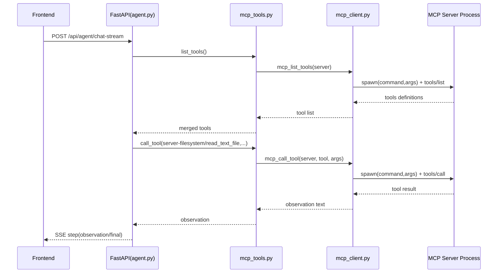

# Agent +MCP Demo 项目总结

## 1. 项目整体架构

这是一个“可运行的 Agent 工程样例”，目标是把以下链路串起来：

- 前端发起问题
- 后端进行 ReAct 推理与工具调度
- 工具既可以是本地内置实现，也可以是外部 MCP Server
- 推理过程通过 SSE 实时回传到前端


### 1.1 分层视角


## 2. 各部分概念与横向扩展


## 2.1 Agent 推理模式：ReAct 与 Plan-and-Execute

项目中的 Agent 主路径在 `app/routers/agent.py`，核心做法是：

- LLM 输出标准 JSON 步骤（thought / action / observation / final）
- 后端执行 action 后把 observation 回灌给模型
- 直到得到 final 或达到 max_steps

这里同时支持两种执行形态：

1. **单步 ReAct**：每轮只返回一个步骤，强依赖上一轮 observation
2. **多步计划模式**：一次返回 JSON 数组，后端按序执行（Plan-and-Execute 风格）

横向扩展建议：

- ReAct 更适合高不确定任务（如网页抓取、复杂检索）
- Plan-and-Execute 更适合结构化任务（如“先读文件再汇总”）
- 工程上可以加入“动态模式切换策略”：根据任务类型或历史失败率选择模式

## 2.2 MCP 协议与 stdio 连接机制

这一节只讲概念层：

- MCP 在本项目里承载“工具发现（tools/list）+ 工具执行（tools/call）”
- 当前默认传输方式是 **stdio + JSON-RPC**
- 与此同时，MCP 生态也支持向 SSE/Streamable HTTP、WebSocket 等方式扩展

本项目的“具体实现细节”（internal 怎么启动、external 怎么接、`npx server-filesystem` 怎么配）统一放到 **3.3** 章节。

横向扩展（连接方式）：

- **stdio（当前实现）**
  - 优点：本地开发简单、隔离性好
  - 场景：单机演示、IDE 本地工具链
- **SSE / Streamable HTTP**
  - 优点：天然跨机器与云部署
  - 场景：多实例、网关化、服务治理
- **WebSocket**
  - 优点：双向通信能力强
  - 场景：需要更细粒度实时交互的工具调用

可演进方向：

- 为 `McpServer` 增加 `transport_type` 字段（stdio/http/sse/ws）
- 在 `mcp_client` 做传输层适配器，统一上层 `tools/list` 与 `tools/call`

## 2.3 工具系统：Schema 驱动 + 统一调度

项目的工具体系有两个关键特征：

- **Schema 驱动**：工具参数使用 JSON Schema 描述并存储在 DB
- **统一调度**：Agent 不关心工具来源（内置 or 外部 MCP），统一由 `mcp_tools.py` 分发

在这个项目里，“注册”分两个层面：

1. **工具元数据注册（Tool 表）**
   - 接口：`POST /api/tools`
   - 存的是工具 schema 和描述，供 Agent 理解“可调用什么”
2. **MCP Server 注册（McpServer 表）**
   - 接口：`POST /api/mcp-servers`
   - 存的是 server 启动方式（command/args/cwd），供后端知道“去哪里调用”

两者结合后，系统才能同时具备“会选工具”与“能真正执行工具”。

价值：

- 新工具接入成本低
- 模型可基于 schema 做更稳定的参数构造
- 工具治理（开关、审计、限流）可以在调度层集中处理

## 2.4 SSE 流式返回：可观测性的基础

`/api/agent/chat-stream` 通过 SSE 实时推送：

- meta：会话元数据
- step：thought/action/observation/final
- done：最终答案

这种设计让前端可以“逐步可视化 Agent 思考轨迹”，是调试与产品化的关键能力。

可扩展方向：

- step 级耗时、token 用量、失败重试次数上报
- 将 step 事件写入审计日志，支持回放


## 3. 已实现能力（由浅入深）

## 3.1 基础能力：可运行的全栈闭环

- FastAPI 后端 + React 前端可以完整联调
- 支持同步接口 `/api/agent/chat`
- 支持流式接口 `/api/agent/chat-stream`
- 会话消息持久化到 SQLite

## 3.2 工具能力：内置工具与注册机制

当前内置工具：

- `get_weather`：基于 wttr.in 查询天气
- `http_get_text`：抓取 URL 文本并截断
- `browser_screenshot`：Playwright 截图并输出静态资源 URL

这保证了“查询 + 抓取 + 页面观察”三类常见 Agent 动作都可用。

在这个项目里，“工具注册”分两个层面：

1. **工具元数据注册（Tool 表）**
   - 接口：`POST /api/tools`
   - 存的是工具 schema 和描述，供 Agent 理解“可调用什么”
2. **MCP Server 注册（McpServer 表）**
   - 接口：`POST /api/mcp-servers`
   - 存的是 server 启动方式（command/args/cwd），供后端知道“去哪里调用”

两者结合后，系统才能同时具备“会选工具”与“能真正执行工具”。

## 3.3 MCP 能力：internal / external 接入实现细节

项目里的关键机制是：**后端进程统一扮演 MCP Client，internal 与 external 都按“子进程 stdio”接入**。

### 3.3.1 本系统中的三类工具来源

1. **内置 Python 工具（直连）**
   - 代码位置：`app/internal_tools_impl.py`
   - 在 `mcp_tools.call_tool` 中可直接本地调用

2. **内部 MCP Server（internal）**
   - 代码位置：`app/internal_mcp_server.py`
   - 配置方式：`command=python, args=["-m","app.internal_mcp_server"]`

3. **外部 MCP Server（如 server-filesystem）**
   - 配置方式：`command=npx, args=["-y","@modelcontextprotocol/server-filesystem","/"]`
   - 工具名形式：`server-name/tool-name`，如 `server-filesystem/read_text_file`

### 3.3.2 internal MCP server 的启动方式

`python -m app.internal_mcp_server` 在本项目中是“由后端按需拉起”的子进程，不要求你手工常驻启动：

- 先在 `mcp_servers` 表配置 internal 记录
- 后端执行 `tools/list` / `tools/call` 时临时启动进程
- 请求响应完成后进程退出

### 3.3.3 外部 server-filesystem 接入示例（npx）

```json
POST /api/mcp-servers/
{
  "name": "server-filesystem",
  "command": "npx",
  "args": ["-y", "@modelcontextprotocol/server-filesystem", "/"],
  "cwd": "/Users/pxy/PycharmProjects/mcp_train",
  "enabled": true
}
```

```text
POST /api/mcp-servers/{id}/refresh-tools
```

刷新后可用工具会缓存到 `last_tools_json`，常见名称示例：

- `server-filesystem/read_text_file`
- `server-filesystem/list_directory`
- `server-filesystem/write_file`

### 3.3.4 Agent 到 MCP 的调用链



### 3.3.5 排障最小检查清单

- internal 不通：确认 `command` 指向当前虚拟环境的 `python`，`args` 为 `["-m","app.internal_mcp_server"]`
- external 不通：确认本机可执行 `npx`，且 npm 能拉取包
- tools/list 为空：先执行 refresh-tools，再检查 `last_tools_json`
- 工具名找不到：确认调用全名 `server-name/tool-name`

这意味着项目已经具备“从单体工具到工具生态”的扩展基础。

## 3.4 推理能力：结构化 ReAct 执行

- 模型被约束输出 JSON（对象或数组）
- 后端支持容错解析（代码块剥离、JSON 片段提取）
- action 后自动生成 observation 并回灌
- 支持多步计划数组顺序执行

这是一套可控、可追踪、可调试的 Agent 执行内核。

## 3.5 工程能力：配置化与可运营性

- 工具配置 API：增删查工具定义
- MCP Server 配置 API：增删查与刷新能力
- 前端提供可视化配置页与执行页
- 静态文件托管用于截图结果直出

这使得该项目不仅“能跑”，还具备了“可演示、可配置、可迭代”的工程形态。

---

## 4. 总结与后续演进建议

当前项目已经完成：

- Agent 推理（ReAct + Plan-and-Execute）
- MCP 工具接入（stdio）
- SSE 实时可视化
- 全栈闭环与持久化

建议下一步优先演进：

1. 多传输协议 MCP（stdio + http/sse）统一适配
2. 工具执行治理（超时、重试、并发隔离、权限）
3. 观测体系（指标、日志、链路追踪）
4. 记忆增强（多轮上下文压缩、长期记忆索引）


